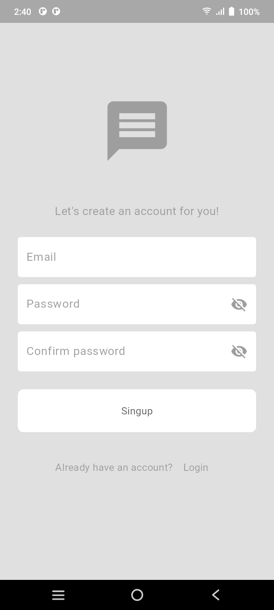
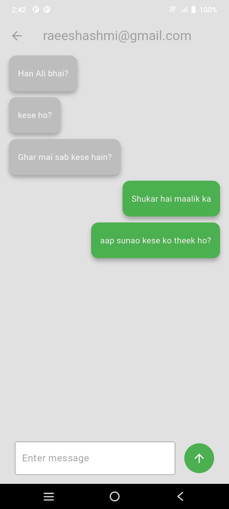

# 💬 ChatNow - Real-Time Messaging App

A modern Flutter chat application with Firebase backend for seamless real-time communication.


## 📱 App Preview

| Sign Up Screen |Login Screen  | Users | Conversation |
|--------------|---------|-----------|--------------|
|  |  |  |  |

## ✨ Key Features

### 🔐 Authentication
- Email/Password login & signup
- Secure password reset
- Profile management
- Logout functionality

### 💬 Chat Features
- Real-time messaging
- View all registered users
- Online/offline status
- Message timestamps
- Clean chat interface

## 🛠️ Tech Stack

**Frontend**:
- Flutter (Cross-platform framework)
- Provider (State management)
- Firebase UI (Pre-built auth components)

**Backend**:
- Firebase Authentication (User management)
- Cloud Firestore (Real-time database)
- Firebase Storage (Optional for media)

## 🚀 Installation Guide

```bash
# 1. Clone repository
git clone https://github.com/yourusername/ChatNow.git
cd ChatNow

# 2. Install dependencies
flutter pub get

# 3. Set up Firebase:
- Add your Firebase config files:
  • Android: `android/app/google-services.json`
  • iOS: `ios/Runner/GoogleService-Info.plist`
  
# 4. Run the app
flutter run